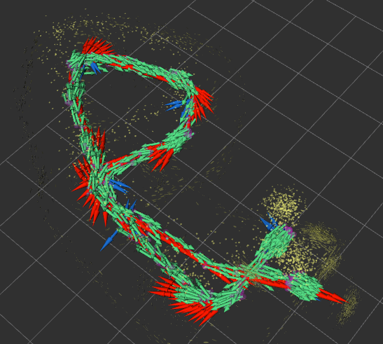

# Real-Time-MFR-PINP-Robot-State-Estimation
<table>
  <tr>
    <td></td>
    <td></td>
  </tr>
</table>

Implementation of multi-fidelity residual physics-informed neural process (MFR-PINP)-based state estimation ROS2 node. Both models capable of being ran on edge devices like Raspberry Pi at <=30 Hz. (Future TODO: Gradient updates will be offloaded to a remote computer for even further real-time feasibility). Includes additional residual, attention-based deep Kalman filter baseline. For further details on results and analysis while using UKF (unscented Kalman filter) ground-truth for training, observe our findings [here](https://arxiv.org/pdf/2511.08231). Note that the robot image at the top of the README depicts the robotic platform utilized in this study known as the DevBot 2.0 - a four-wheeled skid-steering robot equipped with speed encoders, an Adafruit 9-DOF BNO055 IMU, an RPLIDAR A2M8 360-deg laser scanner, and Realsense D435i camera sensor. The image to the right depicts the visual prediction performance between ground truth pose trajectory (green), MFR-PINP-predicted trajectory (blue), and deep Kalman Filter (red).
